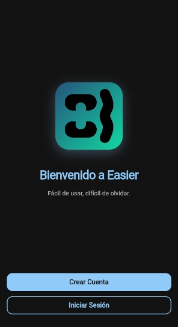
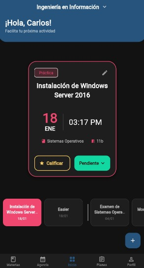
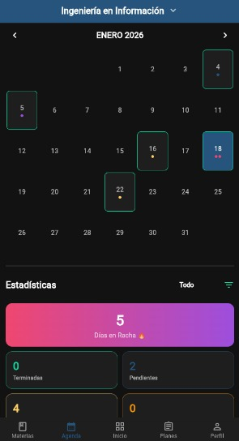
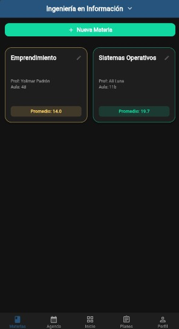
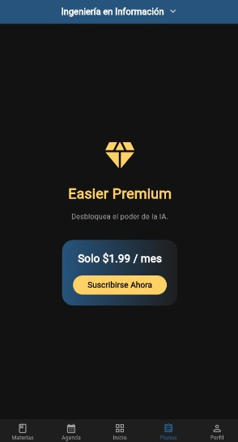
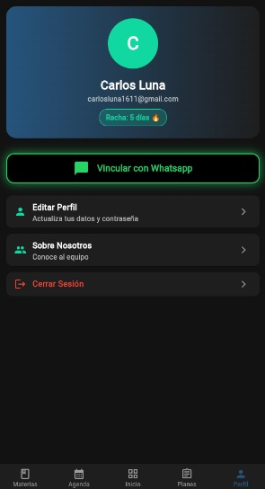
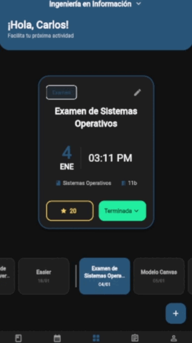

# 📅 Easier - Agenda Escolar Inteligente

**Easier** es una solución integral para la gestión académica que combina una aplicación móvil moderna con potentes automatizaciones de backend. Diseñada para estudiantes que buscan optimizar su tiempo, centraliza horarios, tareas y recordatorios en un solo lugar, con sincronización inteligente de datos.


## 🚀 Características Principales

### 📱 Aplicación Móvil (Flutter)
- **Multiplataforma:** Disponible para Android e iOS.
- **Gestión de Horarios:** Visualización clara de clases y materias.
- **Seguimiento de Tareas:** Lista de pendientes con estados (Pendiente, En Progreso, Completado).
- **Interfaz Intuitiva:** Diseño limpio y moderno enfocado en la experiencia de usuario (UX).

### ⚡ Automatización (n8n)
- **Sincronización Inteligente:** Flujos de trabajo en **n8n** que conectan la app con servicios externos (Bases de Datos).
- **Gestión de Datos:** Procesamiento de información en segundo plano sin cargar el dispositivo móvil.

## 🛠️ Stack Tecnológico

Este proyecto utiliza una arquitectura híbrida:

* **Frontend:**  
* **Automatización / Backend:** 
* **Plataformas Nativas:** Soporte mediante C++ (Android/Linux) y Swift (iOS).

## 📂 Estructura del Proyecto

```text
easier-agenda-inteligente/
├── app/                 # Código fuente de la aplicación Flutter (Dart)
│   ├── lib/             # Lógica de la interfaz y modelos
│   ├── android/         # Configuración nativa Android
│   └── ios/             # Configuración nativa iOS
├── n8n/
│   └── workflows/       # Archivos .json con los flujos de automatización
├── screenshots/         # Imágenes demostrativas de la aplicación
└── README.md            # Documentación
```

## ⚙️ Instalación y Despliegue
1. Aplicación Móvil (Flutter)
   
Para ejecutar la aplicación en tu entorno local:

```text
Bash

# Navegar a la carpeta de la app
cd app

# Instalar dependencias
flutter pub get

# Ejecutar en un emulador o dispositivo conectado
flutter run
```

2. Flujos de Automatización (n8n)
   
La lógica del servidor reside en los flujos de n8n:

• Tener una instancia de n8n corriendo (Local o Cloud).

• Ir a la carpeta n8n/workflows de este repositorio.

• Importar los archivos .json en tu panel de n8n.

• Configurar las credenciales (API Keys, Webhooks) según sea necesario.

## Screenshots

<div align="center">
  
  
  
</div>
<div align="center">
  
  
  
</div>

<br>

## Video Demostrativo


<div align="center">
  
</div>

<br>

📅 Estado del Proyecto
Versión: 1.0 (Beta)

Estado: 🟡 En desarrollo.
